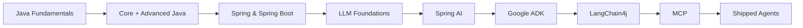

<div align="center">

# ⚡ AgenticJVM

### From `public static void main(String[] args)` to Autonomous Multi-Agent Systems

*A structured, code-first journey through Java — and into the agentic AI stack built on top of it.*

[](https://openjdk.org/)
[](https://spring.io/projects/spring-boot)
[](https://spring.io/projects/spring-ai)
[](https://github.com/langchain4j/langchain4j)
[](https://github.com/google/adk-java)
[](https://modelcontextprotocol.io/)
[](LICENSE)
[](https://github.com/YOUR_USERNAME/agentic-jvm/commits/main)

</div>

---

## 🧭 What This Is

**AgenticJVM** is a public, code-backed learning system that takes the JVM ecosystem all the way from first principles to production-grade autonomous agents.

Most "agentic AI" content online lives in Python. This repo is the opposite bet: **everything here is built on Java** — the language most enterprise systems actually run on — using the frameworks now bringing agentic AI into that world: **Spring AI, Google's Agent Development Kit (ADK), LangChain4j, and the Model Context Protocol (MCP)**.

This is not a notes dump. Every module ships runnable code, every concept has a corresponding implementation, and every block ends in something deployable.

> **Why public?** Because the best way to prove you understand a stack this new is to build in the open and let the commit history, issues, and shipped agents speak for themselves.

---

## 🗺️ The Roadmap



| Block | Focus | Status |
|---|---|---|
| `00` | Java Fundamentals (syntax → OOP basics) | ⬜ |
| `01` | Core Java (collections, streams, generics, concurrency) | ⬜ |
| `02` | Advanced Java (JVM internals, reflection, design patterns) | ⬜ |
| `03` | Spring Framework (DI, AOP, Spring MVC) | ⬜ |
| `04` | Spring Boot (auto-config, REST, data, testing) | ⬜ |
| `05` | LLM Foundations — NLP → Transformers → LLMs in Java | ⬜ |
| `06` | Spring AI — ChatClient, RAG, Advisors, Vector Stores | ⬜ |
| `07` | Google ADK — LlmAgent, workflow & multi-agent patterns | ⬜ |
| `08` | LangChain4j — AI Services, Supervisor & P2P agentic patterns | ⬜ |
| `09` | MCP — building & consuming Java MCP servers | ⬜ |
| `10` | Capstone Projects | ⬜ |

> Tracker is also maintained live as [GitHub Issues](../../issues) — one issue per syllabus topic, closed as completed.

---

## 📂 Repository Structure

```
agentic-jvm/
├── 00-java-fundamentals/
├── 01-core-java/
├── 02-advanced-java/
├── 03-spring-framework/
├── 04-spring-boot/
├── 05-llm-foundations/
│   └── nlp-to-transformers/
├── 06-spring-ai/
│   ├── chatclient-prompts/
│   ├── memory-advisors/
│   └── rag-pipelines/
├── 07-google-adk/
│   ├── first-agent/
│   ├── workflow-agents/        # sequential, parallel, loop
│   └── multi-agent-a2a/
├── 08-langchain4j/
│   ├── ai-services/
│   ├── tool-calling/
│   └── supervisor-p2p/
├── 09-mcp/
│   ├── mcp-server-java/
│   └── mcp-client-integration/
├── 10-projects/
│   ├── ai-travel-planner-agent/      → Google ADK
│   ├── ai-customer-support-bot/      → LangChain4j
│   └── ecom-ai-capstone/             → Spring AI + PGVector + ADK
├── docs/
│   └── diagrams/
└── LEARNING_LOG.md
```

Each numbered module has its own `README.md` with: learning objectives → key concepts → runnable code → what broke and why.

---

## 🚀 Featured Builds

### ✈️ AI Travel Planner Agent — *Google ADK*

Multi-agent system (Flight Agent + Hotel Agent + Itinerary Agent) coordinated by an orchestrator. Takes destination, budget, and dates; returns a compiled, end-to-end travel plan using live flight/hotel tool integrations.

`[📁 Code](./10-projects/ai-travel-planner-agent)` · `[🔗 Live Demo](#)`

### 🎧 AI Customer Support Bot — *LangChain4j*

RAG-powered support agent grounded in product docs and FAQs, with persistent conversation memory, tool calling for order status/ticketing, and agentic routing to department-specific sub-agents.

`[📁 Code](./10-projects/ai-customer-support-bot)` · `[🔗 Live Demo](#)`

### 🛒 E-Com AI Capstone — *Spring AI + PGVector + ADK*

Full-stack AI commerce backend: semantic product search via PGVector, a `ChatClient`-backed conversational assistant, DALL·E-generated product visuals, and ADK agents handling order management — with Grafana/Prometheus observability wired in.

`[📁 Code](./10-projects/ecom-ai-capstone)` · `[🔗 Live Demo](#)`

---

## 🛠️ Tech Stack

**Language & Core:** Java 21, Maven/Gradle
**Frameworks:** Spring Boot 3.x, Spring AI 2.0, LangChain4j, Google ADK
**Agentic Infra:** Model Context Protocol (MCP), Agent-to-Agent (A2A) protocol
**Vector & Storage:** PGVector, Redis Vector Store, SimpleVectorStore
**Models:** OpenAI, Anthropic, Hugging Face, Ollama (local)
**Observability:** Grafana, Prometheus, Spring AI Evaluators
**Deployment:** Docker, AWS SageMaker, Google Cloud Run

---

## 🏁 Getting Started

**Prerequisites**

- JDK 21+
- Maven 3.9+ or Gradle 8+
- Docker (for PGVector / Redis locally)
- An OpenAI/Anthropic API key (or Ollama for local models)

```bash
# Clone
git clone https://github.com/YOUR_USERNAME/agentic-jvm.git
cd agentic-jvm

# Run any module independently, e.g.:
cd 06-spring-ai/rag-pipelines
mvn spring-boot:run
```

Each module's own `README.md` has module-specific setup (API keys, Docker compose for vector DBs, etc.).

---

## 📓 Learning Log

Weekly devlogs on what was built, what broke, and what clicked differently the second time through — kept in [`LEARNING_LOG.md`](./LEARNING_LOG.md) and mirrored in [Discussions](../../discussions).

---

## 📜 License

MIT — see [LICENSE](./LICENSE). Use it, fork it, learn from it.

---

<div align="center">

**Built by [Your Name]** · [LinkedIn](#) · [Portfolio](#)

*If this helped you learn agentic AI on the JVM, a ⭐ helps others find it too.*

</div>
